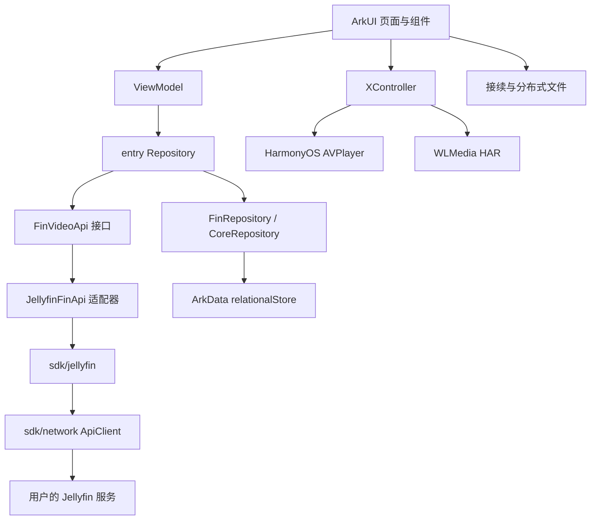
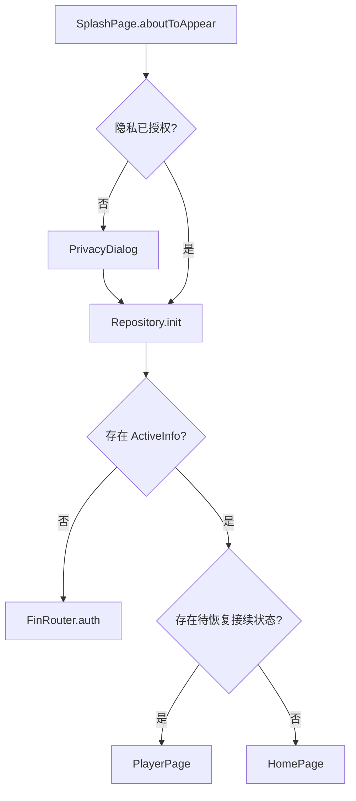
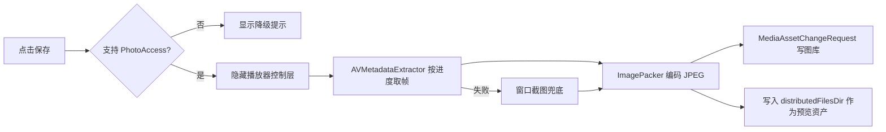

# FinVideo / MediaHub 源码深度解析报告

## 1. 报告目的与阅读范围

本文不是只列目录的项目简介，而是以“应用怎样真正运行”为主线，对 FinVideo 的工程配置、启动生命周期、持久化、Repository、Jellyfin SDK、页面与 ViewModel、播放器、响应式布局、应用接续和分布式文件能力进行逐层解析。

报告分析对象是课程仓中的实际源码：

```text
finvideo-study/FinVideo/
```

分析基线与课程增量需要明确区分：

- **上游基线**：`OHPG/FinVideo v0.3.3`，提交 `d76959b8d25627d864cf854cbabcfd730c8852a2`。
- **课程增量**：搜索增强、播放器设置重置、最近播放、视频截屏、多端响应式、续播码、系统应用接续、分布式文件和 SysCap 降级等。
- **实际支持边界**：Jellyfin 主链路已有完整实现；Emby 虽然存在 SDK 和工厂分支，但 `EmbyFinApi` 仍是未完成骨架。

建议第一次阅读按“启动 → 数据 → 页面 → 播放 → 跨端”的顺序进行；需要定位某项新增功能时，可直接查看第 18～24 节。

## 2. 项目基本信息

| 项目 | 内容 |
| --- | --- |
| 应用名称 | FinVideo；课程扩展场景使用 MediaHub 名称 |
| 上游仓库 | <https://github.com/OHPG/FinVideo> |
| 选用版本 | `v0.3.3` |
| 上游提交 | `d76959b8d25627d864cf854cbabcfd730c8852a2` |
| 应用包名 | `com.github.wz167838.mediahub` |
| 应用模型 | HarmonyOS Stage 模型 |
| UI 技术 | ArkTS + ArkUI 声明式组件 |
| 构建系统 | DevEco Hvigor |
| 包管理 | OHPM |
| 核心后端 | Jellyfin 10.10+ |
| 播放内核 | HarmonyOS `AVPlayer`、第三方 WLMedia |
| 目标设备 | phone、tablet、2in1 |

选择 `v0.3.3` 的原因是可复现性。上游 `master` 在本地验证时引用 `@ohpg/player@0.6.3`，该版本无法从公开 OHPM 源取得；`v0.3.3` 可以正常安装依赖和构建，因此更适合作为课程分析与扩展基线。

## 3. 产品定位与数据边界

FinVideo 是私有媒体服务器客户端，不是自带资源的在线视频平台。应用负责：

1. 保存服务器地址和用户授权信息。
2. 调用 Jellyfin API 读取媒体库、电影、剧集、收藏、播放历史和媒体源。
3. 把 Jellyfin SDK 模型转换成应用统一模型 `FinItem`。
4. 使用 ArkUI 页面展示数据。
5. 把可播放 URL 交给系统 `AVPlayer` 或 WLMedia。
6. 将播放开始、进度和停止状态回传服务器。

影视文件、海报、用户信息和服务端播放记录都来自用户自己的 Jellyfin。课程仓不包含服务器凭据、访问令牌或影视资源。

## 4. 工程全景与模块依赖

### 4.1 顶层结构

```text
FinVideo/
├── AppScope/                     # 应用级资源与 app.json5
├── entry/                        # 主应用 HAP 模块
│   ├── libs/libwlmedia.har       # 第三方播放器 HAR
│   └── src/main/
│       ├── ets/                  # 页面、仓储、API、播放器和课程扩展
│       ├── resources/            # 字符串、颜色、图片、页面清单
│       └── module.json5          # 模块、Ability、设备类型与权限
├── framewrok/                    # 上游保留的原始目录拼写
│   ├── lib_core/                 # 核心实体、RDB、事件、窗口和断点
│   └── lib_framework/            # 通用页面、路由、ViewModel、刷新组件
├── sdk/
│   ├── network/                  # Axios / RCP 请求封装
│   ├── jellyfin/                 # Jellyfin API 与模型
│   ├── emby/                     # Emby SDK
│   └── komga/                    # Komga SDK，主应用未接入核心链路
├── build-profile.json5
├── oh-package.json5
└── hvigorfile.ts
```

`framewrok` 看起来像拼写错误，但它是上游工程既有目录名，并且被本地依赖路径引用。课程仓保留该名称是为了避免模块解析失效。

### 4.2 逻辑依赖图



这套结构的核心价值是“变化隔离”：页面不直接调用 Jellyfin SDK，播放器页面也不负责拼接媒体 URL。服务端协议、业务仓储和 UI 分别位于不同层。

## 5. 构建配置、模块声明与依赖

### 5.1 主模块依赖

`entry/oh-package.json5` 中的关键依赖如下：

| 依赖 | 来源 | 作用 |
| --- | --- | --- |
| `@abner/refresh` | OHPM | 列表刷新数据源与交互 |
| `@ohpg/network` | `../sdk/network` | 网络请求基础层 |
| `@ohpg/emby` | `../sdk/emby` | Emby SDK；当前业务适配未完成 |
| `@ohpg/jellyfin` | `../sdk/jellyfin` | Jellyfin API 与模型 |
| `@ohpg/fin-core` | `../framewrok/lib_core` | 核心实体、存储、事件、断点 |
| `@ohpg/fin-framework` | `../framewrok/lib_framework` | 路由、登录、ViewModel 和通用 UI |
| `libwlmedia` | `entry/libs/libwlmedia.har` | 第三方播放内核 |

本地模块用 `file:` 引用，意味着整个仓库本身就是一个多模块工程。只复制 `entry/` 无法完整构建。

### 5.2 Ability 和设备声明

`entry/src/main/module.json5` 声明：

- `mainElement` 为 `EntryAbility`。
- `srcEntry` 为 `ets/app/App.ets`。
- 支持 `phone`、`tablet`、`2in1`。
- `EntryAbility` 设置 `continuable: true`，允许系统把它识别为可接续 Ability。
- 请求 `INTERNET`、`WRITE_IMAGEVIDEO`、`READ_PASTEBOARD` 权限。

这些配置分别对应网络访问、截图写入图库和续播码读取。需要注意，模块权限声明只是“具备申请资格”，运行时仍要遵守系统权限、用户授权和 SysCap 能力检查。

### 5.3 页面注册

`entry/src/main/resources/base/profile/main_pages.json` 注册了启动页、主页、详情页、播放器、搜索、跨设备续播、文件流转、设置、关于和法律页面。ArkUI 路由跳转的字符串必须与这里的路径一致，否则页面无法被加载。

## 6. 应用启动与生命周期

### 6.1 `App.ets`：应用级对象装配

`entry/src/main/ets/app/App.ets` 中的 `App` 继承 `AbilityStage`。`onCreate()` 完成四件事：

1. 将应用颜色模式设为跟随系统。
2. 创建 `AppPrefer` 并放入 `AppStorage`。
3. 创建 `AppConfig` 并放入 `AppStorage`。
4. 创建 `Repository` 并放入 `AppStorage`。

```text
AbilityStage.onCreate
  ├── AppStorage[prefer]     = AppPrefer
  ├── AppStorage[config]     = AppConfig
  └── AppStorage[Repository] = Repository
```

对象创建顺序有实际意义：`AppConfig` 构造时会从 `AppStorage` 读取 `AppPrefer`，所以偏好对象必须先创建。后续 ViewModel 通过 `AppStorage` 获取同一个 Repository，避免每个页面重复连接数据库或创建 API 客户端。

### 6.2 `EntryAbility.ets`：窗口、接续与系统能力

`entry/src/main/ets/ability/entry/EntryAbility.ets` 是 UIAbility 入口，关键生命周期如下：

| 生命周期 | 行为 |
| --- | --- |
| `onCreate()` | 配置 `ContinuationFileStore` 的 Context，尝试读取接续 Want |
| `onWindowStageCreate()` | 初始化窗口、沉浸式模式、安全区域、应用接续、启动页与断点系统 |
| `onNewWant()` | 应用已存在时接收新的接续参数，并发出接续事件 |
| `onContinue()` | 把当前播放状态写入 `wantParam`，决定同意或拒绝迁移 |
| `onWindowStageWillDestroy()` | 解除窗口、安全区域和断点监听 |

窗口创建链路：

```text
EntryAbility.onWindowStageCreate
  -> DeviceUtil.initWindow(mainWindow)
  -> setImmersiveModeEnabledState(true)
  -> activateContinuation()
  -> AvoidAreaSystem.register()
  -> loadContent('pages/splash/SplashPage')
  -> BreakpointSystem.register(mainWindow)
```

`activateContinuation()` 先用 `DeviceCapability.supportsAppContinuation()` 检查能力，再调用 `setMissionContinueState(ACTIVE)`。这比无条件调用系统 API 更适合多设备工程：不支持能力的设备会记录警告并继续运行普通功能。

### 6.3 `SplashPage.ets`：隐私、初始化与首屏分流

启动页完成三层判断：

1. 检查 `AppPrefer.isPrivacyGrant()`。
2. 未授权时展示 `PrivacyDialog`，用户同意后再初始化。
3. 调用 `Repository.init()` 恢复当前服务器、地址和用户。

初始化完成后：

- 如果存在 `ActiveInfo`，优先检查是否有待恢复的跨端播放状态；没有则进入 `HomePage`。
- 如果不存在账号，调用框架层 `FinRouter.auth()` 进入添加服务器/登录流程。



当前 `initAndWait()` 的 `catch` 是空的，数据库初始化失败时最终仍会继续分流。这能避免启动页永久卡住，但会损失错误可观测性，后续应记录日志并给出可恢复提示。

## 7. 全局状态、偏好与运行配置

### 7.1 `AppStorage` 中的共享对象

| Key | 对象 | 生命周期 |
| --- | --- | --- |
| `prefer` | `AppPrefer` | 应用进程级 |
| `config` | `AppConfig` | 应用进程级 |
| `Repository` | `Repository` | 应用进程级 |
| `currentAvoidArea` | 当前窗口安全区域 | 窗口级更新 |
| 当前宽高断点 | `BreakpointSystem` 维护 | 窗口尺寸变化时更新 |
| 当前/待恢复接续状态 | JSON 字符串 | 播放与接续期间 |

### 7.2 `AppPrefer.ets`

`AppPrefer` 使用 ArkData `preferences` 保存轻量键值：

- 隐私授权状态。
- 播放器实现选择。
- 排序方式与升降序。
- 每页数据量。

课程新增的 `resetPlayerImpl()` 将播放器实现写回 `PlayerImpl.AUTO`。把重置放在偏好层而不是页面直接操作 key，能避免 UI 依赖存储细节。

### 7.3 `AppConfig.ets`

`AppConfig` 在构造时读取偏好，并形成运行期配置：`sortBy`、`sortOrder`、`pageSize`。`JellyfinFinApi.getItemList()` 会使用这些配置生成查询参数。

这里需要区分“持久化偏好”和“当前内存配置”：如果设置页只更新 `AppPrefer` 而没有同步 `AppConfig` 或触发重建，当前进程中的查询策略可能暂时仍使用旧值。事件 `EVENT_SORT_INFO_CHANGED` 就是为这种状态同步预留的通道。

## 8. 本地数据库与账号模型

### 8.1 数据库结构

`framewrok/lib_core/src/main/ets/store/` 使用 `relationalStore`。数据库文件名为 `fin_store.db`，版本为 1，包含四张表：

| 表 | 主要字段 | 用途 |
| --- | --- | --- |
| `ServerInfoTable` | serverId、serverName、serverType | 保存媒体服务器 |
| `AddressInfoTable` | addressId、address、serverId | 一个服务器的多个访问地址 |
| `UserInfoTable` | userId、userName、accessToken、serverId | 登录用户与授权令牌 |
| `ActiveInfoTable` | serverId、addressId、userId | 当前激活组合 |

模型不是简单的“一账号一地址”。它允许一个服务端保存多个地址和多个用户，再由 `ActiveInfo` 指向当前组合，便于在内网地址、外网地址和不同用户之间切换。

### 8.2 数据库创建与并发保护

`StoreHelper.getStore()` 使用 `ArkTSUtils.locks.AsyncLock` 避免多个异步调用同时创建或升级数据库。首次打开时：

1. 调用 `relationalStore.getRdbStore()`。
2. 检查数据库版本。
3. 开启事务。
4. 执行四张表的建表 SQL。
5. 更新版本并提交；失败则回滚。

`AppStoreHelper` 设置 `securityLevel: S1`，并使用 `encrypt: !BuildProfile.DEBUG`：发布构建启用数据库加密，Debug 构建不加密。因此调试环境中的 access token 仍应按敏感数据处理，不应上传数据库文件或输出完整内容。

### 8.3 `CoreRepository.init()` 恢复活动账号

`queryActive()` 先读取活动表中的三个 ID，再分别查询服务器、地址和用户。只有三者都存在才返回完整 `ActiveInfo`。`CoreRepository.initActiveInfo()` 随后：

- 根据 `serverType` 创建或复用 API。
- 把地址、用户 ID 和 access token 注入 API。
- 更新 `AppStorage` 中的活动信息。
- 发出 `EVENT_ACTIVE_INFO_CHANGED`。

这保证页面不会拿到只有一半的账号状态。

## 9. 登录、服务器校验与切换流程

登录逻辑主要位于 `CoreRepository.authAccount()`：

```text
输入 serverType + URL + 用户名/密码
  -> ApiFactory.createApi(serverType)
  -> getPublicSystemInfo(URL)
  -> 检查服务器初始化状态和版本
  -> 检查数据库中是否重复
  -> auth(username, password)
  -> 组装 ServerInfo / AddressInfo / UserInfo
  -> DataStore.insertActive()
  -> initActiveInfo()
```

Jellyfin 服务器要求版本至少为 10.10。地址 ID 使用 URL 的 MD5 摘要，能在同一服务器下区分不同入口，同时用于重复检测。

切换服务器、地址或用户时，Repository 会更新 `ActiveInfo`，写回数据库并重新调用 `initActiveInfo()`。如果服务类型变化，旧 API 会被 `release()`，再由工厂创建新实例。

## 10. Repository 分层与业务边界

Repository 分为三层：

| 层 | 文件 | 职责 |
| --- | --- | --- |
| 核心仓储 | `lib_core/.../CoreRepository.ets` | 数据库、账号、地址、API 生命周期 |
| 通用媒体仓储 | `lib_framework/.../FinRepository.ets` | 收藏、取消收藏、已播放/未播放 |
| FinVideo 业务仓储 | `entry/.../Repository.ets` | 首页、媒体库、详情、搜索、媒体源、播放回传、最近播放 |

页面 ViewModel 只依赖最上层 `Repository`。具体服务端协议被 `FinVideoApi` 隔离，数据库细节被 `CoreRepository` 隔离。

`Repository` 的主要业务方法可以按场景分组：

- 首页：`getResumeItems()`、`getNextUp()`、`getLibraryList()`、`getLibraryLatestMedia()`。
- 列表与详情：`getLibraryMediaList()`、`getMovie()`、`getShow()`、`getSeasons()`、`getEpisodes()`、`getEpisode()`。
- 用户操作：`getFavourite()`、`searchMedia()`、`getItemData()`。
- 播放：`getMediaSource()`、`onPlaybackStart()`、`onPlaybackProgress()`、`onPlaybackStopped()`。
- 课程新增：`getRecentPlaybackItems()`、`recordRecentPlayback()`。

## 11. API 工厂：抽象设计与实际支持边界

### 11.1 工厂设计

`FinVideoApiFactory.onCreateApi()` 根据 `ServerType` 返回 `JellyfinFinApi` 或 `EmbyFinApi`。这种工厂 + 接口设计理论上允许 UI 完全复用。

```text
Repository.requireApi()
  -> FinVideoApi
      ├── JellyfinFinApi
      └── EmbyFinApi
```

### 11.2 当前真实状态

不能只看到工厂分支就宣称“同时支持 Jellyfin 和 Emby”。当前代码事实是：

- `Repository.getSupportServer()` 只返回 `ServerType.JELLYFIN`。
- `JellyfinFinApi` 已实现查询、详情、搜索、播放源、收藏和进度回传。
- `EmbyFinApi` 绝大多数方法直接 `throw new Error("Method not implemented.")`。

因此更准确的表述是：**架构为多服务端适配预留了接口，当前可用主链路是 Jellyfin，Emby 适配尚未完成。**

## 12. 网络层与 Jellyfin SDK

### 12.1 `ApiClient`

`sdk/network/src/main/ets/api/ApiClient.ets` 封装两类请求通道：

- Axios：GET、POST、DELETE。
- Remote Communication Kit `rcp.Session`：PATCH、PUT。

`updateServer()` 会规范化 base URL，同时重建 Axios 客户端和 RCP Session。`getHeaders()` 统一设置：

- `Content-Type`。
- `Accept`。
- `Authorization`。
- HarmonyOS `User-Agent`。

查询参数序列化器显式处理数组，把每个元素编码为重复的 query key，符合 Jellyfin 许多 API 的参数形式。

### 12.2 Jellyfin 授权头

`JellyfinApiClient.getAuthorization()` 生成 MediaBrowser 兼容授权头，包含客户端、设备、设备 ID、版本和 token。token 来自当前活动用户，切换用户时由 `updateUserInfo()` 更新。

### 12.3 SDK 门面

`sdk/jellyfin/src/main/ets/Jellyfin.ets` 是 SDK 门面，按需创建 `ItemsApi`、`TvShowsApi`、`MediaInfoApi`、`PlayStateApi` 等对象。页面不会直接接触这些生成 API；它们由 `JellyfinFinApi` 调用。

## 13. `JellyfinFinApi`：协议到统一模型的适配

### 13.1 为什么需要适配层

Jellyfin SDK 返回 `BaseItemDto`、`UserItemDataDto` 等协议模型。若页面直接使用这些类型，UI 会被 Jellyfin 字段名和单位绑定，未来切换后端将非常困难。`JellyfinFinApi` 负责把它们转换为统一的 `FinItem`、`FinItemData` 和 `FinPage`。

### 13.2 核心字段映射

`itemToFinItem()` 的映射包括：

| Jellyfin 字段 | 应用字段 | 处理 |
| --- | --- | --- |
| `Id` | `id` | 直接映射 |
| `Name` | `name` | 直接映射 |
| `Type` | `type` | 转为 `FinItemType` |
| `RunTimeTicks` | `runtimeTicks` | 除以 10000，转为毫秒 |
| `UserData.PlaybackPositionTicks` | `playedPositionTicks` | 除以 10000，转为毫秒 |
| `ImageTags` / item ID | `image.primary/backdrop` | 拼接 Jellyfin 图片 URL |
| `People` | `person` | 转换演员/人员及头像 URL |
| `ParentIndexNumber` / `IndexNumber` | 季/集索引 | 用于剧集显示 |

Jellyfin 使用 100 ns tick，播放器使用毫秒。因此 API 适配层统一除以 10000；向服务端回传时，播放器抽象层再乘以 10000。

### 13.3 业务 API 对应关系

| 应用方法 | Jellyfin SDK 调用 | 用途 |
| --- | --- | --- |
| `getResumeItems()` | `ItemsApi.getResumeItems()` | 继续观看 |
| `getNextUp()` | `TvShowsApi.getNextUp()` | 下一集 |
| `getLibraryList()` | `UserViewsApi.getUserViews()` | 媒体库入口 |
| `getLatestItems()` | `UserLibraryApi.getLatestMedia()` | 最近入库 |
| `getMovie()/getShow()/getEpisode()` | `UserLibraryApi.getItem()` | 详情 |
| `getSeasons()` | `TvShowsApi.getSeasons()` | 季列表 |
| `getEpisodes()` | `TvShowsApi.getEpisodes()` | 集列表 |
| `getFavourite()` | `ItemsApi.getItems(IsFavorite)` | 收藏 |
| `search()` | `ItemsApi.getItems(searchTerm)` | 搜索 |
| `getItemSource()` | `MediaInfoApi.getPlaybackInfo()` | 获取播放源 |

### 13.4 媒体源 URL

`getItemSource()` 读取 `MediaSources[0]`，检查视频流的 HDR/SDR 信息，再按协议处理：

- `File`：构造 `/Videos/{id}/stream.{container}?static=true&mediaSourceId=...`。
- `Http`：直接使用服务端返回的 `Path`。

随后 `appendPlaybackToken()` 把 `api_key` 放入 URL 查询参数。原因是 `AVPlayer` 最终只接收 URL，无法复用普通 API 请求中的自定义 Authorization 头。

容器选择优先 `mp4`，否则使用 Jellyfin 返回的第一个容器，缺失时回退为 `mp4`。

## 14. ViewModel、刷新框架与页面状态

### 14.1 ViewModel 继承链

```text
ViewModel (lib_core)
  -> FinViewModel<Repository> (lib_framework)
      -> AppViewModel (entry)
          -> 各业务 ViewModel
```

`FinViewModel` 从 `AppStorage` 获取全局 Repository。业务 ViewModel 因此只负责参数、加载顺序和页面所需的数据组合。

### 14.2 列表 ViewModel

`ListViewModel` 实现 `RefreshRepository`，持有 `RefreshDataSource`，并要求子类实现 `loadData(type)`。`ListRefreshView`、`GridRefreshView` 等框架组件通过统一接口触发加载并读取数据源。

这个结构把刷新 UI 与业务请求解耦：页面不需要自行维护 loading/error/empty 的全部状态，ViewModel 只需把新数组写入数据源。

### 14.3 事件机制

`AppEventHub` 支持 `on`、`off`、`once` 和 `emit`。当前重要事件包括：

- 活动账号变化。
- 排序配置变化。
- 最近播放变化。
- 接收到系统接续参数。

页面在 `aboutToAppear()` 注册、`aboutToDisappear()` 解除监听。例如 `HomePage` 监听接续事件，防止 Ability 已经存在时收到 `onNewWant()` 却没有跳转播放器。

## 15. 页面路由与主要页面

### 15.1 首页 `HomePage`

主页使用 `Tabs` 组织四个入口：

| Tab | 组件 | 数据来源 |
| --- | --- | --- |
| 主页 | `MainComponent` | 最近播放、继续观看、下一集、最近入库 |
| 媒体库 | `MediaComponent` | `getLibraryList()` |
| 收藏 | `FavouriteComponent` | `getFavourite()` |
| 设置 | `PreferComponent` | 账号、地址、播放器、跨端入口 |

小屏时 Tab 位于底部；中大屏时 `.vertical(true)` 并把 Tab 放在左侧。这是多端布局最直观的差异之一。

### 15.2 首页数据组合

`MainViewModel.loadData()` 按顺序组装 `GroupInfo[]`：

1. 本地最近播放。
2. Jellyfin 继续观看。
3. Jellyfin 接下来播放。
4. 遍历每个媒体库并读取最近媒体。

每一组最终交给 `MainNormalGroup` 渲染。普通媒体和最近播放使用竖版 `MediaItem`，继续观看和下一集使用横版 `EpisodeItem`。

目前每个媒体库的最近内容是 `for...of + await` 串行获取，逻辑清晰但媒体库较多时首屏会变慢，可在保证服务端压力可控的前提下改为有限并发。

### 15.3 媒体路由

`MediaRouter.openDetail()` 根据 `FinItemType` 决定目标：

- Movie → `MoviePage`。
- Series → `ShowPage`。
- 其他媒体库入口 → `MediaListPage`。

这样海报组件不需要了解具体页面路径，只需把 `FinItem` 交给路由工具。

### 15.4 电影和剧集详情

`MovieViewModel` 获取单个电影，并把 `item.data` 作为当前用户状态。`DetailViewModel` 提供收藏/取消收藏、已播放/未播放切换。

`ShowViewModel` 会组合：

- 剧集基本信息。
- 接下来播放的第一集。
- 季列表。

这说明 ViewModel 不一定一一对应单个 API；它可以把多个请求组合成页面需要的聚合模型 `ShowInfo`。

### 15.5 搜索页

`SearchViewModel.search()` 先 trim 关键词，再调用 `loadData()`。结果按 Movie、Series、Episode 分组为 `SectionInfo[]`。课程新增的 `clearResult()` 同时清空关键词和数据源，保证 UI 立即回到空结果。

`SearchPage` 在原结果页上方加入 Search 输入框与“清空”按钮，用户无需退回上级页面即可改词。不同结果类型仍分别使用竖版海报和横版剧集卡。

## 16. 最近播放：本地闭环设计

最近播放是课程新增功能，位于 `Repository` 和首页 ViewModel。

`recordRecentPlayback()` 的规则：

1. 忽略没有 ID 的媒体。
2. 先移除相同 ID 的旧记录。
3. 把当前媒体插入数组头部。
4. 最多保留 8 条。
5. JSON 序列化写入 ArkData Preferences。
6. 发出 `EVENT_RECENT_PLAYBACK_CHANGED`。

存储 key 由 `serverId + userId` 隔离，避免多个 Jellyfin 账号共享历史。若登录信息尚未就绪，则暂时使用默认 key。

进入播放器并加载到 `FinItem` 后，`PlayerPage.updateItem()` 调用 `PlayerViewModel.recordRecentPlayback()`。因此最近播放记录的是“实际打开过的媒体”，不是仅浏览过详情的媒体。

## 17. 播放器总体架构

播放器由四层组成：

```text
PlayerPage                    页面状态、控件、手势、生命周期
  -> XController              Surface 与播放实现选择、统一回调
      -> AbstractPlayer       统一播放接口和服务端进度回传模板
          ├── AVPlayer        HarmonyOS 系统播放器
          └── WLPlayer        WLMedia 第三方播放器
```

### 17.1 `PlayerViewModel`

`loadData()` 根据 `PlayerArgs.type` 加载电影或单集。电影只请求 `getMovie()`；Episode 还尝试加载同季列表，用于上一集/下一集。

`PlayerArgs` 除 ID、名称、类型外，还包含课程新增的 `startPosition`，用于续播码或系统接续恢复播放位置。

### 17.2 `AbstractPlayer`

抽象类统一定义：

- Surface 绑定。
- 数据源设置、prepare、start、pause、stop、reset、seek。
- 时长、位置、视频宽高。
- 音轨、字幕轨、倍速。
- 状态、进度、错误和字幕回调。
- 播放开始、进度、停止回传模板。

通过这一层，`PlayerPage` 不必为两种播放内核写两套 UI 逻辑。

### 17.3 `XController`

`XController` 继承 `XComponentController`，负责：

1. 接收 Surface 创建/变化/销毁回调。
2. 从 Repository 获取可播放 URL。
3. 根据偏好创建 `AVPlayer` 或 `WLPlayer`。
4. 把底层播放器回调转发给页面。
5. 根据视频和窗口宽高计算 Inside/Crop Surface 尺寸。
6. 用 `AVMetadataExtractor` 按当前进度提取真实视频帧。

课程版 `AUTO` 策略固定选择 `AVPlayer`。代码注释给出的原因是 WLMedia 的 x86_64 原生库可能使 DevEco 模拟器崩溃。显式选择 WLMedia 仍然可用，但自动模式优先保证本地演示稳定。

### 17.4 `AVPlayer` 状态机

系统播放器的关键状态链路：

```text
setData(url)
  -> initialized
  -> 绑定 surfaceId 并 prepare
  -> prepared
  -> 恢复未完成进度、应用倍速、play
  -> playing
  -> 每秒回调当前进度
```

若媒体播放百分比不超过 98%，且存在服务端记录位置，就在 `prepared` 阶段 seek。字幕更新后会按字幕 duration 设置定时器清空文本。

### 17.5 `WLPlayer`

WLMedia 通过 `WlPlayer` 提供更丰富的解码兼容性。它在 `onPrepared` 后读取视频轨宽高、恢复播放位置并启动；`onTimeInfo` 把秒转换成毫秒，每 5 次回调触发一次服务端进度上报。

它还把 WLMedia 音轨/字幕轨描述转换成 HarmonyOS `media.MediaDescription`，让页面使用同一套轨道选择对话框。

## 18. `PlayerPage`：状态、交互与生命周期

`PlayerPage.ets` 超过千行，是本项目最复杂的单文件。它同时管理：

- 当前媒体、上一集/下一集能力。
- 播放器状态、prepared、loading、进度和总时长。
- 控制层显示、3 秒自动隐藏、锁定状态。
- 横向拖动进度、纵向亮度/音量、双击快进、长按临时倍速、双指缩放。
- 键盘 Space/Escape/方向键，适配 2in1。
- 字幕文本、倍速和音轨选择。
- 视频截屏、续播码和系统接续状态。

### 18.1 初始化

`aboutToAppear()`：

1. 恢复用户亮度并隐藏系统栏。
2. 手机竖屏时切到横屏自动旋转。
3. 2in1 最大化窗口进入沉浸模式。
4. 注册播放器状态、进度、错误和字幕回调。
5. 调用 `initData()`。

播放器进入 `prepared` 后，页面读取 duration、应用跨端 `startPosition`，再开始播放。

### 18.2 进度恢复

恢复来源有两种：

- 普通打开：底层播放器读取 `FinItem.data.playedPositionTicks`，恢复 Jellyfin 服务端进度。
- 跨端打开：`PlayerArgs.startPosition` 在页面 `applyTransferStartPosition()` 中覆盖到指定进度。

为了避免 seek 到媒体末尾，跨端位置若大于 duration，会调整为 `duration - 1000`。

### 18.3 页面隐藏与销毁

`onPageHide()` 先保存接续状态；若正在播放则暂停，并标记返回页面时恢复。

`aboutToDisappear()` 清理：

- 当前接续状态。
- UI 自动隐藏定时器。
- 播放器回调和实例。
- 2in1 窗口监听。
- 系统栏和原屏幕方向。
- 屏幕亮度。

这类资源清理非常重要，否则播放器、窗口回调和定时器会在页面退出后继续占用资源。

## 19. 播放进度单位与服务端回传

项目存在三种相关单位：

| 层 | 单位 |
| --- | --- |
| Jellyfin API | 100 ns tick |
| 应用 `FinItem` / 页面 / AVPlayer | 毫秒 |
| WLMedia 部分 API | 秒 |

转换关系：

```text
Jellyfin tick / 10000 = 毫秒
WLMedia 秒 * 1000 = 毫秒
毫秒 * 10000 = Jellyfin tick
```

`AbstractPlayer.reportPlaybackUpdate()` 会把当前位置乘以 10000，再调用 Repository。`JellyfinFinApi` 最终调用 `PlayStateApi.onPlaybackProgress()`。

当前实现存在一个值得注意的不对称：WLPlayer 明确调用 `reportPlaybackStart/Update/Stop()`，但 `AVPlayer` 没有对应调用。课程版 AUTO 又固定走 AVPlayer，因此服务端播放进度回传可能不完整。后续应把回传策略放到 `AbstractPlayer` 的统一状态处理，或在 AVPlayer 的 initialized/playing/pause/release 节点补齐，避免两种内核行为不一致。

## 20. 视频截图到系统图库

课程新增截图链路位于 `PlayerPage`、`XController` 和 `ContinuationFileStore`：



关键设计点：

1. 优先解码视频源真实帧，避免 Surface 截图黑屏或只截到控件。
2. 失败时回退 `Window.snapshot()`。
3. 控制层临时隐藏并等待 120 ms，使兜底截图尽量干净。
4. JPEG 质量为 95，文件名包含时间戳。
5. 使用 `MediaAssetChangeRequest` 把内存 buffer 写入系统图库。
6. 同一 buffer 写入 `distributedFilesDir/mediahub-continuation/`，可作为接续轻量文件资产。

`capturingSnapshot` 防止重复点击导致并发写入，`finally` 会恢复 UI、释放 PixelMap 和 ImagePacker。

## 21. 响应式布局与多端部署

### 21.1 断点来源

`BreakpointSystem` 监听窗口宽度并把当前断点写入 `AppStorage`。页面通过 `@StorageProp(BreakpointSystem.CURRENT_WIDTH_BREAKPOINT)` 响应变化。

### 21.2 集中式布局 token

课程新增 `ResponsiveLayout.ets`，集中提供：

- 页面左右边距。
- 首页工具栏高度。
- 海报和剧集卡片宽度。
- 网格卡片缩放及 clamp 范围。
- 详情页最大宽度和间距。
- 季列表列数、封面宽度和行高。

这种方式优于在每个页面散落 `if (breakpoint...)` 和魔法数字。后续调整平板密度时只需修改一个文件。

### 21.3 主要布局变化

| 场景 | 小屏 | 中/大屏 |
| --- | --- | --- |
| 首页 Tab | 底部横向 | 左侧纵向 |
| 页面边距 | 16 vp | 24 / 32 vp |
| 海报卡片 | 140 vp | 168 / 196 vp |
| 剧集横卡 | 200 vp | 260 / 320 vp |
| 详情区 | 单栏为主 | 更宽容器或双栏 |
| 季列表 | 1 列 | 2 / 3 列 |

项目还补充鼠标 hover、键盘焦点和双指捏合网格密度，体现“同一功能在触屏、鼠标和键盘下都能使用”的交互归一。

### 21.4 工程级多端声明

`module.json5` 明确包含 phone、tablet、2in1，使同一个 HAP 模块覆盖三类设备；页面再通过运行时断点完成布局级适配。这对应“一套工程 + 一套页面逻辑 + 多种布局结果”。

## 22. 续播码：稳定的跨设备兜底方案

续播码不依赖系统发现另一台设备，适合课堂演示和系统接续不可用时兜底。

### 22.1 状态模型

`FinTransferSession` 只包含：

- `version`。
- 媒体 `id`、`name`、`type`。
- `position`、`duration`。
- `createdAt`。

它不包含服务器 URL、用户名、token 或视频流，因此不会把账号凭据带到另一台设备。接收端使用自己的本地 Jellyfin 配置重新拉流。

### 22.2 编解码

`TransferSessionCodec` 使用前缀 `FINVIDEO_TRANSFER_V1:`，后接 URI 编码的 JSON。解码时校验前缀、版本、ID、名称和非负进度。

### 22.3 发送与接收

播放器 `copyTransferSession()` 把续播码写入系统剪贴板。`TransferPage` 支持：

- PasteButton 安全读取剪贴板。
- 手动粘贴文本。
- 实时解析并预览名称和进度。
- 打开 `PlayerPage` 并通过 `startPosition` 恢复。

剪贴板不可用时，页面保留手动粘贴路径，这是明确的能力降级，而不是直接让功能消失。

## 23. HarmonyOS 系统应用接续

系统级接续在续播码模型上增加了 UIAbility 生命周期和分布式文件支持。

### 23.1 源端保存当前状态

`PlayerPage` 在以下时机调用 `updateContinuationSession()`：

- 媒体加载完成。
- 播放进度变化。
- 页面隐藏。

状态序列化后暂存在 `AppStorage`。

### 23.2 系统触发迁移

系统调用 `EntryAbility.onContinue(wantParam)`。`ContinuationStateStore.writeCurrentSessionToWant()`：

1. 读取当前播放状态。
2. JSON 序列化并计算 UTF-8 字节数。
3. 确保小于 100 KB。
4. 写入版本、场景和内联 session。
5. 尝试写分布式文件清单，并把文件名、大小、数量加入 Want。
6. 成功时返回 `AGREE`，无状态或过大时返回 `REJECT`。

### 23.3 接收端恢复

接收端可能从 `onCreate()` 或 `onNewWant()` 收到参数：

```text
Want.parameters
  -> 先读 distributedFilesDir 中的 manifest
  -> 文件尚未同步或读取失败时，回退内联 session
  -> 保存为 pending session
  -> SplashPage/HomePage 消费 pending session
  -> PlayerPage(startPosition)
```

先文件、后 Want 的策略同时覆盖了“文件已同步”和“文件尚未到达”两种时序。

### 23.4 为什么不迁移视频文件

视频通常很大，也可能只是远端流。实现只迁移小状态、JSON 清单和可选 JPEG 预览图；接收端用媒体 ID 和本地登录状态重新请求 Jellyfin。这既控制 Want 大小，也避免跨端复制大视频。

## 24. 分布式文件与无线文件流转

项目中有两套相关但用途不同的文件逻辑。

### 24.1 接续文件清单 `ContinuationFileStore`

目录：

```text
context.distributedFilesDir/mediahub-continuation/
```

清单包含版本、场景、创建时间、播放 session 和轻量文件列表。截图预览图保存后，其元数据暂存在 `AppStorage`，下一次生成接续清单时会被加入 `files`。

文件名经过白名单清洗，只允许字母、数字、点、下划线和短横线，降低路径穿越风险。

### 24.2 独立文件流转 `WirelessFileTransferStore`

目录：

```text
context.distributedFilesDir/mediahub-wireless-transfer/
```

发送端流程：

1. `DocumentViewPicker.select()` 最多选择 5 个文件。
2. 把 URI 内容复制到分布式目录。
3. 为文件生成唯一 storedName。
4. 写入 manifest。

接收端流程：

1. 优先读取 manifest。
2. 检查每个记录对应文件是否存在。
3. manifest 尚未同步时扫描目录作为兜底。
4. 用户通过 `DocumentViewPicker.save()` 选择目标路径。
5. 把分布式目录文件复制到用户选择位置。

页面还可生成一个小型文本演示文件，解决课堂现场没有合适文件可选的问题。

### 24.3 文件 manifest 的作用

单纯同步文件只能得到内部存储名。manifest 额外保存：

- 原始文件名。
- 存储文件名。
- 相对路径。
- 大小、来源、创建时间。

因此接收端可以展示可读名称、按时间排序并安全另存。

## 25. SysCap 能力检查与降级路径

`DeviceCapability.ets` 集中封装 `canIUse()`，覆盖：

| 能力 | SysCap | 回退策略 |
| --- | --- | --- |
| 应用接续 | `SystemCapability.Ability.AbilityRuntime.Core` | 使用续播码 |
| 文件 IO | `SystemCapability.FileManagement.File.FileIO` | 仅迁移续播状态 |
| 系统文件选择器 | `SystemCapability.FileManagement.UserFileService` | 生成演示文件 |
| 剪贴板 | `SystemCapability.MiscServices.Pasteboard` | 手动粘贴续播码 |
| 图库 | `SystemCapability.FileManagement.PhotoAccessHelper.Core` | 禁用截图保存并提示 |

`canIUse()` 本身也被 try/catch 包裹，预览器或不完整运行环境抛出异常时统一视为不支持。

`FileTransferPage` 会把每项能力直接显示为 `OK` 或 `Fallback`，这既是用户提示，也是课堂验收页：演示者可以现场说明当前设备走的是直接 API 还是降级路径。

## 26. 错误处理、资源释放与可观测性

### 26.1 已做得较好的部分

- 播放器错误通过回调显示 Toast。
- 截图全链路使用 try/finally 释放 PixelMap、ImagePacker 和提取器。
- Ability 销毁时注销窗口、断点和安全区域监听。
- 页面消失时注销事件和播放器回调。
- 数据库建表使用事务与回滚。
- 分布式文件操作失败时返回 `undefined` 或空数组，使普通播放功能不被拖垮。

### 26.2 当前不足

多处 `catch (_) {}` 完全吞掉异常，例如启动初始化、分布式文件、文件 manifest 和部分 Toast。这样做能保证演示不中断，但无法区分权限拒绝、路径错误、同步延迟和 JSON 损坏。

建议建立统一的 `Logger` 标签和错误类别：

- 用户取消：不报错或仅 debug。
- 能力不支持：显示 fallback 提示。
- 数据损坏：记录文件/版本信息但不记录敏感内容。
- 网络/鉴权失败：向页面提供可操作错误。
- 编程错误：保留堆栈并在 debug 构建暴露。

## 27. 安全、隐私与权限分析

### 27.1 敏感数据

`UserInfoTable` 保存 access token。发布构建数据库启用加密，但 Debug 构建不加密，所以：

- 不应提交设备沙箱数据库。
- 不应在日志、截图或报告中展示 token。
- 导出续播状态时不得加入 token 或服务器凭据。

当前 `FinTransferSession` 的最小字段设计符合这一原则。

### 27.2 播放 URL

为了让 AVPlayer 访问静态流，Jellyfin token 被追加为 `api_key` 查询参数。这是客户端播放器约束下的实际做法，但 URL 必须视为敏感信息，不应完整打印到日志或错误界面。

### 27.3 权限最小化

应用声明网络、图库写入和剪贴板读取。文件选择通过系统 Picker 由用户主动授权目标 URI，而不是申请宽泛的全盘文件访问。截图保存和剪贴板读取也都有显式用户动作。

## 28. 性能与可维护性分析

### 28.1 优点

1. API、Repository、ViewModel 和页面分层明确。
2. SDK 模型在适配层一次转换，页面使用稳定的统一实体。
3. `LazyForEach` 和刷新数据源适合较长列表。
4. 图片 URL 按需生成，不把图片二进制持久化到业务模型。
5. 响应式 token 集中维护，降低多页面数值漂移。
6. 两种播放器共用控制器和抽象接口，便于替换实现。
7. 跨端状态小而明确，避免大对象进入 Want。

### 28.2 可优化点

1. `PlayerPage.ets` 超过千行，UI、手势、截图、轨道和接续职责过多，可拆成控制层组件与 service。
2. 首页逐库串行请求最近媒体，首屏耗时随媒体库数量线性增长。
3. `JellyfinFinApi.itemToFinItem()` 每次都创建图片 URL，可考虑不可变映射工具或测试覆盖。
4. 多处错误被吞掉，真机问题难定位。
5. SDK 自动生成模型数量很大，应在文档中强调业务入口位于 `entry`，避免阅读者被模型文件淹没。
6. `DataStore` 查询结果集未统一显式 close，需核对 ArkData 生命周期最佳实践并封装释放。
7. `AppConfig` 是构造期快照，偏好更新与运行配置同步机制需要更清晰。

## 29. 已识别的代码风险与改进建议

以下是根据当前源码得出的改进清单，不等于本次文档任务已经修改这些代码。

### P0：影响核心正确性

1. **AVPlayer 播放回传不完整**：`AVPlayer` 没有像 `WLPlayer` 一样调用 `reportPlaybackStart/Update/Stop()`，AUTO 又默认走 AVPlayer。应统一两种内核的 Jellyfin 进度回传。
2. **Episode 列表参数可疑**：`PlayerViewModel.loadData()` 调用 `getEpisodes(this.itemDto.seasonId!, this.itemDto.seasonId!)`，把 seasonId 同时作为 seriesId 和 seasonId。应确认 `FinItem` 是否缺少 `seriesId` 映射，并修正上一集/下一集数据源。

### P1：影响功能完整性

1. **Emby 适配未完成**：工厂存在分支但 `EmbyFinApi` 仍抛出未实现错误。应完成适配或暂时移除用户可达入口，避免错误预期。
2. **AUTO 策略未使用 HDR/SDR 判断**：`getItemSource()` 返回 `sdr`，但 `XController` 当前没有使用它。若真机需要 HDR 或格式自动选择，应重新设计策略，同时保留模拟器安全判断。
3. **分页 more 计算需测试边界**：`resultToFinPage()` 使用 `cur + length < TotalRecordCount - 1`，可能产生末页 off-by-one，应针对 0、1、整页和非整页总数补单测。

### P2：影响维护和排障

1. 为 Splash、Continuation、WirelessTransfer 的空 catch 增加结构化日志。
2. 把 PlayerPage 的截图、手势和接续逻辑拆为可测试 service/component。
3. 对 `TransferSessionCodec`、UTF-8 大小计算、manifest 版本与文件名清洗补单元测试。
4. 为 Repository 的账号隔离最近播放补测试。
5. 对响应式 token 加预览页或快照测试，避免小屏修改破坏大屏。

## 30. 上游能力与课程新增能力对照

| 能力 | 上游基线 | 课程增量 |
| --- | --- | --- |
| Jellyfin 登录与媒体浏览 | 有 | 保留并修复本地复现 |
| 电影/剧集详情、收藏、搜索 | 有 | 搜索结果页支持就地改词/清空 |
| AVPlayer / WLMedia | 有 | AUTO 模式针对模拟器稳定性调整、设置重置 |
| 继续观看 | 服务端能力 | 增加本地最近播放分组 |
| 视频截图 | 无本次课程实现 | 真实帧提取、JPEG、图库、分布式预览 |
| 基础断点系统 | 已有基础 | 集中响应式 token、多页面和多输入适配 |
| 手工跨设备续播 | 无 | 续播码、剪贴板与手动粘贴 |
| 系统应用接续 | 无本次课程实现 | continuable、Want、小状态与恢复 |
| 分布式文件 | 无本次课程实现 | 接续 manifest、预览资产、独立文件流转 |
| SysCap 可见降级 | 不完整 | 集中能力检查与验收页 |

这个对照对于课程答辩很重要：应说明“我在理解上游分层后新增了什么”，而不是把开源项目原有播放器或 Jellyfin API 说成本次从零开发。

## 31. 构建、运行与验证

### 31.1 构建命令

```powershell
cd finvideo-study/FinVideo
ohpm install
hvigor assembleHap --stacktrace
```

产物：

```text
entry/build/default/outputs/default/entry-default-unsigned.hap
```

安装与启动：

```powershell
hdc install -r entry/build/default/outputs/default/entry-default-unsigned.hap
hdc shell aa start -b com.github.wz167838.mediahub -a EntryAbility
```

### 31.2 已有验证

2026-05-12 已完成本地依赖安装、HAP 构建、安装到 `127.0.0.1:5555` 模拟器并成功启动 `EntryAbility`。后续功能改动继续使用 Hvigor 构建核验。

课程仓还提供受限的公网 Jellyfin 测试入口，仅包含改前、改后两段作业演示视频，便于教师直接验证登录、媒体库读取和 Range 视频流。连接方式与已验证边界见 `REMOTE_TEST.md`；报告不重复保存登录信息，避免源码解析正文与测试账号维护状态耦合。

### 31.3 证据边界

- 构建成功：证明语法、依赖和工程配置能够通过编译打包。
- 单模拟器启动：证明主 Ability 和普通页面链路可运行。
- Jellyfin 播放：还需要可访问的服务器、账号和兼容媒体。
- 截图到图库：需要设备具备 PhotoAccess 能力并完成用户授权。
- 系统接续与分布式文件：必须用满足条件的双真机验证，不能由单模拟器结果替代。

## 32. 推荐源码阅读路线

### 路线 A：10 分钟理解启动和首页

1. `entry/src/main/ets/app/App.ets`
2. `entry/src/main/ets/ability/entry/EntryAbility.ets`
3. `entry/src/main/ets/pages/splash/SplashPage.ets`
4. `entry/src/main/ets/pages/home/HomePage.ets`
5. `entry/src/main/ets/pages/home/main/MainViewModel.ets`

### 路线 B：理解一次完整网络请求

1. `entry/src/main/ets/pages/detail/movie/MovieViewModel.ets`
2. `entry/src/main/ets/data/Repository.ets`
3. `entry/src/main/ets/api/FinVideoApi.ets`
4. `entry/src/main/ets/api/jellyfin/JellyfinFinApi.ets`
5. `sdk/jellyfin/src/main/ets/Jellyfin.ets`
6. `sdk/network/src/main/ets/api/ApiClient.ets`

### 路线 C：理解播放器

1. `entry/src/main/ets/pages/player/PlayerPage.ets`
2. `entry/src/main/ets/pages/player/PlayerViewModel.ets`
3. `entry/src/main/ets/pages/player/XController.ets`
4. `entry/src/main/ets/player/AbstractPlayer.ets`
5. `entry/src/main/ets/player/AVPlayer.ets`
6. `entry/src/main/ets/player/WLPlayer.ets`

### 路线 D：理解多设备扩展

1. `entry/src/main/ets/capability/DeviceCapability.ets`
2. `entry/src/main/ets/adaptive/ResponsiveLayout.ets`
3. `entry/src/main/ets/continuation/ContinuationStateStore.ets`
4. `entry/src/main/ets/continuation/ContinuationFileStore.ets`
5. `entry/src/main/ets/pages/transfer/TransferSessionCodec.ets`
6. `entry/src/main/ets/pages/filetransfer/WirelessFileTransferStore.ets`

## 33. 核心源码索引

| 主题 | 文件 |
| --- | --- |
| 应用级初始化 | `entry/src/main/ets/app/App.ets` |
| Ability 生命周期 | `entry/src/main/ets/ability/entry/EntryAbility.ets` |
| 隐私与首屏分流 | `entry/src/main/ets/pages/splash/SplashPage.ets` |
| 全局业务仓储 | `entry/src/main/ets/data/Repository.ets` |
| 数据库与账号 | `framewrok/lib_core/src/main/ets/data/CoreRepository.ets`、`store/DataStore.ets` |
| API 工厂与接口 | `entry/src/main/ets/api/FinVideoApiFactory.ets`、`FinVideoApi.ets` |
| Jellyfin 适配 | `entry/src/main/ets/api/jellyfin/JellyfinFinApi.ets` |
| 网络请求 | `sdk/network/src/main/ets/api/ApiClient.ets` |
| 首页 | `entry/src/main/ets/pages/home/` |
| 搜索 | `entry/src/main/ets/pages/search/` |
| 详情 | `entry/src/main/ets/pages/detail/` |
| 播放器页面 | `entry/src/main/ets/pages/player/PlayerPage.ets` |
| 播放器抽象/实现 | `entry/src/main/ets/player/` |
| 响应式布局 | `entry/src/main/ets/adaptive/ResponsiveLayout.ets` |
| SysCap | `entry/src/main/ets/capability/DeviceCapability.ets` |
| 系统接续 | `entry/src/main/ets/continuation/` |
| 续播码 | `entry/src/main/ets/pages/transfer/` |
| 文件流转 | `entry/src/main/ets/pages/filetransfer/` |

## 34. 总结

FinVideo 的价值不只在于“能播放视频”，而在于它展示了一个真实 HarmonyOS 应用如何组织复杂业务：Stage 生命周期负责装配与窗口，Repository 统一业务访问，API 适配层隔离服务端协议，ViewModel 组合页面数据，播放器抽象统一多内核，框架模块复用登录、路由和刷新组件。

课程扩展没有绕开原架构另写一套孤立 Demo，而是沿已有分层加入最近播放、截图、多端布局、续播码、系统接续和分布式文件能力。`DeviceCapability` 又为不同设备提供明确降级，使项目在真机能力不足或课堂环境受限时仍有可展示路径。

同时，源码分析也暴露了真实工程的未完成边界：Emby 只是骨架、AVPlayer 服务端进度回传需要补齐、Episode 上下集参数需要核查、播放器大文件需要拆分。这些结论来自当前代码，而不是 README 宣称；能够同时说明架构优点、运行事实和改进方向，才是本次源码学习最重要的成果。
